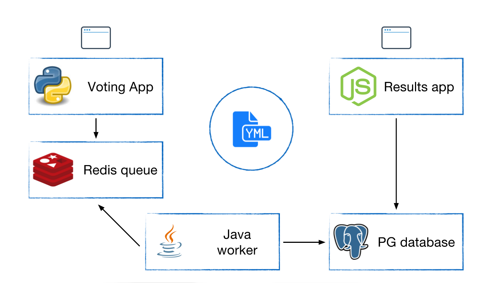

# Docker tutorial

### About the Docker tutorial :whale2: :boat:
- [Docker App Architecture](#Docker-App-Architecture)
- [Pre-tutorial preparation](#pre-tutorial-preparation)
- [Tutorial guidelines](./tutorial.md)

### Docker App Architecture:

Participants in the training will go through the steps involved in running and developing a simple voting app from a fresh computer using the Docker Toolbox. This simple app will include:

- **A Python webapp**: which lets you vote between several options
- **A Redis queue**: which collects new votes
- **A Java worker**: which consumes votes and stores them in…
- …**A Postgres database**: backed by a Docker volume
- **A Node.js webapp**: which shows the results of the voting in real time

There will be a self-paced beginners’ tutorial for attendees to learn Docker basics as they build and deploy this app locally. Experienced Docker users will serve as mentors to help beginners successfully complete the training.

### Pre-tutorial preparation
At the training, you will need to bring your own computer. There are some steps you should do some preparation to get your work environment ready. Here are the steps:

1. For MacOS users, need you to install [Docker engine MacOS](https://www.docker.com/docker-mac) and [Docker engine Windows](https://docs.docker.com/docker-for-windows/install/)
[Docker compose](https://docs.docker.com/compose/install/).

And now you're ready. See you at the meetup!
